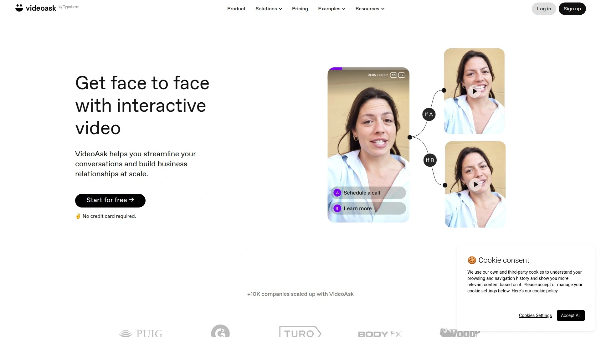

# 2025's Top 10 Best Video Testimonial Collection Platforms

Asking clients for testimonials feels like requesting a favor nobody wants to give—awkward silences, forgotten promises, and half-hearted text reviews that sound like hostage statements. Video testimonial software eliminates the cringe factor by making it dead simple for customers to record authentic praise without downloading apps, figuring out complicated interfaces, or feeling like they're auditioning for a reality show. Modern platforms handle everything from guiding nervous clients through step-by-step prompts to automatically editing out those "ums" and long pauses that make everyone sound unprofessional.

Whether you're running a coaching business, SaaS company, or ecommerce store, these platforms turn customer love into sales-boosting social proof that actually converts. The best tools don't just collect videos—they transform raw testimonial footage into polished, branded assets ready for your website, email campaigns, and social media within minutes rather than weeks. Video testimonials increase conversion rates significantly compared to text reviews, mainly because seeing a real human enthusiastically praise your product carries weight that generic five-star ratings simply can't match.

## **[StoryPrompt](https://www.storyprompt.com)**

The effortless way to collect authentic video, voice, and text testimonials without awkward client interactions.

StoryPrompt operates on one simple premise: getting testimonials should never feel cringey for you or your clients. Send clients a single link where they record responses directly in their browser—no apps to download, no accounts to create, no technical headaches that make people give up halfway through. The platform's AI-powered teleprompter guides clients through recording perfect videos even if they've never been comfortable on camera before, which dramatically increases response rates compared to leaving clients to figure it out themselves.

**Three-step collection system:** Share your StoryPrompt link with a client, receive an on-brand video or text testimonial within hours, then publish to your website or embed in email campaigns with one-click simplicity. The platform automatically stitches individual video clips together, adds your branding, inserts background music, and removes filler words like "um" and "ah" that make amateur videos feel unprofessional. These automatic editing features mean you get dazzling video testimonials on autopilot without hiring video editors or learning complex software.

For camera-shy clients who refuse to appear on video, StoryPrompt offers voice recording and written testimonial options with headshots and star ratings. This flexibility ensures you never lose a testimonial just because someone hates seeing themselves on camera. Every client can record with blurred backgrounds or virtual backgrounds, which eliminates concerns about messy home offices appearing in testimonials. Prompts and script outlines guide clients on what to say, dramatically reducing those rambling testimonials that start strong but trail off into confusion.

**Wall of Love display and website integration:** The platform's Wall of Love feature transforms collected testimonials into powerful sales tools by showcasing them prominently on your website. StoryPrompt customers who embed a Wall of Love grow faster and acquire more clients than competitors who don't leverage visual social proof. Import reviews from Google, Trustpilot, LinkedIn, ProductHunt, and other platforms to keep all your customer love in one central location. The digital asset manager organizes content specifically for ecommerce workflows rather than generic file storage that makes finding specific testimonials frustrating.

One-click embedding copies HTML code you paste anywhere on your website—no developer required, no separate hosting platform needed. Videos work beautifully across Amazon, Shopify, Meta ads, and email campaigns with proper sizing and technical specifications handled automatically. All content includes unlimited usage rights and royalty-free model licensing, so you never worry about legal issues when repurposing testimonials across different channels. Competitive analysis tools monitor competitor listings and provide actionable suggestions for improving your own product pages.

The integrated AI media editor offers automatic resizing for different platforms, AI-generated scenes that create new assets from existing photos, and background removal. Justin Welsh, a course creator and business coach, summarizes it perfectly: "StoryPrompt makes it super easy for your customers to tell compelling stories about their experiences with your products or services". For businesses tired of chasing clients for testimonials and spending hours editing rough footage, StoryPrompt's automated approach delivers professional results without the typical time investment.

## **[Senja](https://senja.io)**

Comprehensive testimonial platform emphasizing ease of use and unlimited sharing options.

Senja positions itself as the easiest way for creators to gather social proof, build trust, and display testimonials that drive results. The platform combines simplicity with powerful features specifically designed for businesses that want comprehensive testimonial management without technical complexity. Multi-format support handles video, text, and audio testimonials through one-click collection via customizable forms.

One standout advantage—Senja offers thousands of ways to share testimonials through popups, images, widgets, testimonial videos, and Walls of Love. This flexibility exceeds what most competitors provide, where you're limited to one or two display formats that might not match your website design. Beautiful display widgets integrate seamlessly with any website without requiring coding skills. Automated follow-up sequences increase response rates by gently reminding clients who started but didn't finish their testimonials.

**Import capabilities and analytics features:** Import testimonials from 26 external sources including Twitter, LinkedIn, Reddit, App Stores, Google, Trustpilot, and more. Auto-sync functionality with 11 major platforms keeps your testimonial library automatically updated as new reviews appear across the internet. This centralization matters because manually copying testimonials from different platforms wastes hours every week.

AI analysis examines testimonials and reviews to discover insights hidden in your social proof—common themes, frequently praised features, and areas customers mention as weak points. Advanced analytics dashboard tracks testimonial views, engagement, clicks, rates, and submission patterns. These metrics help you understand which testimonials convert best and where to prioritize collection efforts. Export video testimonials in HD on any paid plan for use in presentations, advertising, or sales materials.

White-label options serve agencies and resellers managing testimonials for multiple clients. Social media optimization prepares content for cross-platform sharing with proper aspect ratios and file formats. Plans start at $19 monthly with a generous free tier letting you test the platform before committing. Senja's main limitation—video editing features only include trimming, no advanced editing tools. However, the platform compensates through extensive display options and import sources that competitors lack.

## **[Testimonial.to](https://testimonial.to)**

Quick-setup testimonial collection focused on text and video gathering without developer dependency.

Testimonial.to built its reputation around letting you collect text and video testimonials from customers in minutes with no need for developers or website hosting. The streamlined setup process gets you collecting testimonials faster than competitors with more complex onboarding. Simple interface design works equally well for solo entrepreneurs and small teams who don't have technical resources.

The platform provides customizable collection forms that match your brand styling, making the testimonial request feel like a natural extension of your business rather than a generic third-party tool. Customers record videos or write text responses directly through the form without creating accounts or downloading software. This friction-free experience significantly increases completion rates compared to platforms requiring multiple steps.

**Wall of Love embedding and customization:** Embed your Wall of Love directly onto your website with full customization of layout, design, and features so it blends seamlessly with your brand. The wall displays multiple testimonials in attractive formats that showcase social proof effectively. Multiple layout options let you arrange testimonials in grids, carousels, or masonry styles depending on your website design.

Video testimonials download easily for use in marketing materials beyond your website. Basic editing tools trim videos to highlight the best parts without requiring separate video editing software. The platform handles hosting automatically, so you don't need separate video hosting accounts or worry about bandwidth costs.

Pricing remains competitive for small businesses just getting started with video testimonials. The interface prioritizes speed—you can set up a collection page and start gathering testimonials within 10 minutes of signing up. For businesses valuing simplicity and quick implementation over advanced features, Testimonial.to delivers functional testimonial collection without unnecessary complexity.

## **[Famewall](https://famewall.io)**

Feature-packed testimonial software with affordable pricing and 25+ import sources.

Famewall targets startups and growing businesses with plans costing approximately 50% less than comparable platforms while including all essential features. The platform collects both text and video testimonials through personalized collection pages you share as simple links. Custom video messages on collection pages make requests feel more personal, which increases the likelihood of receiving enthusiastic video testimonials rather than obligatory responses.

Customers decide whether to send text or video testimonials based on their comfort level. Text testimonials require just entering name, designation, email, and other custom fields you specify. Video testimonials let customers select camera and audio sources, record multiple takes, and submit final versions—Famewall handles all hosting and sends notifications when testimonials arrive.

**Import automation and brand pages:** Import testimonials from 25+ platforms including Twitter, LinkedIn, Reddit, App Stores, Google, Trustpilot, and more. This extensive import capability exceeds most competitors who support only a handful of sources. Chrome Extension adds testimonials from anywhere on the internet with one click, useful when you spot great feedback on forums or social media.

Reorganize testimonials across different projects and reuse them whenever you'd like without manually copying files between folders. Brand Pages showcase all your products and display social proof to convert clients faster. Generate testimonial images optimized for social media sharing on the fly. Zapier integration automates testimonial workflows and builds social proof systematically.

Free plan includes 10 text testimonials plus 1 video testimonial with 1 collection form and 1 workspace—generous enough for solopreneurs testing the platform. Paid plans start at $11.99 monthly for 6 video testimonials, scaling to $79.99 monthly for unlimited testimonials, forms, and workspaces. For budget-conscious businesses needing comprehensive features without enterprise pricing, Famewall delivers exceptional value.

## **[VideoAsk by Typeform](https://www.videoask.com)**

Interactive video forms with branching logic making testimonial collection feel conversational.

VideoAsk revolutionizes testimonial collection by making it interactive rather than static. Instead of filling out traditional forms, customers participate in video conversations that feel natural and personal. This conversational approach significantly increases completion rates because the experience feels human rather than transactional.

Branching logic lets you ask different follow-up questions based on initial responses, creating customized experiences for each customer. Real-time notifications alert you the moment testimonials are submitted so you can respond quickly with thank-you messages. Over 1,000 app integrations via Zapier connect VideoAsk with your existing marketing tools and CRM systems.

**Mobile-optimized collection experience:** The platform excels at mobile responsiveness—clients can easily record testimonials from phones without struggling with poorly adapted desktop interfaces. Custom branding and personalization options ensure the collection experience matches your brand identity. Advanced analytics track response patterns showing which questions generate best testimonials and where clients drop off.

VideoAsk's unique strength lies in encouraging people to submit testimonials through mirroring behavior—when clients see you on video asking for testimonials, they feel more confident recording their own videos. This psychological trigger makes camera-shy customers more willing to participate. The platform supports accepting only video responses if you want exclusively video testimonials, or mixing formats based on customer preference.

Pricing includes free plan for testing, with paid plans starting at $24 monthly. The main limitation—advanced video editing capabilities are minimal compared to platforms focused specifically on testimonial production. However, for businesses prioritizing high completion rates and interactive collection experiences, VideoAsk's conversational approach proves highly effective.

## **[Vocal Video](https://vocalvideo.com)**

Professional-style video testimonials with automatic editing, music, and motion graphics.

Vocal Video differentiates itself through automatic editing that inserts music, text overlays, animations, motion graphics, and your branding. You collect professional-looking testimonials and share them with just a few clicks rather than spending hours in editing software. This automation matters for businesses that want polished results but lack video editing skills or time.

Video Collectors (their term for collection campaigns) start from scratch or use templates. Multiple display options show testimonials on your website—embed single videos using eight different card styles, or create galleries in wall of love, slideshow, grid, list, or carousel formats. Every video card includes options to highlight eye-catching quotes from transcripts, encouraging visitors to watch.

**Kiosk Mode and event capabilities:** Kiosk Mode lets you capture video testimonials one after another on the same device. When one respondent finishes, they tap "done" and the screen returns to the first page ready for the next user. This feature excels at events where you want to capture atmosphere and multiple testimonials rapidly. Event highlight reels created through Kiosk Mode have completely different energy than videos created after events.

Analytics from embeds help plan future testimonial strategy by showing which videos perform best. The platform handles remote video collection from customers, employees, and industry experts. Intuitive editing combined with powerful AI and automation simplifies the production process. Vocal Video markets itself as the #1 remote video testimonial platform with emphasis on professional output quality.

Pricing sits higher than budget competitors, with top plans reaching around $2,340. This premium positioning targets businesses prioritizing production value and extensive features over affordability. For companies creating testimonials for high-stakes marketing campaigns where professional polish matters more than cost, Vocal Video's automated editing justifies the investment.

## **[Boast](https://boast.io)**

All-in-one feedback platform combining testimonials, online reviews, surveys, and UGC videos.

Boast goes beyond basic testimonial collection by incorporating online reviews, customer surveys, and user-generated content videos into one platform. This comprehensive approach addresses multiple aspects of customer feedback rather than treating testimonials as isolated from broader reputation management. Over 10,000 organizations have collected video testimonials through Boast, providing social proof of the platform's effectiveness.

The platform makes collecting video testimonials easy while helping businesses leverage all forms of customer feedback to grow. Automatic review collection populates key sites like Google and Facebook without manually requesting reviews on each platform separately. Industry-standard surveys including NPS and CSAT measure customer satisfaction, plus custom surveys gain specific insights.

**User-generated content management:** Request, collect, organize, and share UGC videos for use in ads and social channels. This capability matters for brands building memorable consumer experiences through authentic customer content. Simple experience for customers combined with game-changing results for businesses summarizes Boast's value proposition.

The platform emphasizes building trust with prospects and increasing sales through authentic video testimonials. Video collection happens without hassle—clients don't struggle with complicated recording interfaces or confusing submission processes. Boast positions itself as suitable for businesses wanting comprehensive feedback management rather than only testimonials.

Pricing information isn't prominently displayed on their website, suggesting custom enterprise pricing for larger organizations. For mid-size to enterprise businesses seeking unified platforms handling testimonials, reviews, surveys, and UGC content, Boast's integrated approach simplifies vendor management.

## **[Trustmary](https://trustmary.com)**

Reliable testimonial software with interactive video player and multi-channel distribution.

Trustmary offers businesses means to bolster online reputation and credibility through efficient video testimonial collection. The interactive video player engages website visitors more effectively than static testimonials. Multi-channel distribution options let you share collected testimonials across your website, social media, email campaigns, and advertising simultaneously.

Real-time analytics track testimonial performance showing which videos generate most engagement and conversions. This data helps optimize testimonial strategy by doubling down on what works and adjusting what doesn't. Smooth integration with review sites imports existing reviews alongside newly collected video testimonials. Customizable forms match your brand and ask questions specific to your industry or products.

**Setup and learning considerations:** Initial navigation presents some challenges for new users unfamiliar with the platform. No free plan option means you must commit to paid subscription for testing. However, once past initial setup, the platform operates reliably for ongoing testimonial collection.

Trustmary positions itself as an alternative to platforms like Boast, offering similar functionality at different pricing structures. The platform suits businesses wanting solid testimonial collection with emphasis on distribution and analytics rather than cutting-edge features. For companies prioritizing reputation management and multi-channel testimonial deployment, Trustmary provides dependable infrastructure.

## **[Vouch](https://vouchfor.com)**

Enterprise-focused asynchronous video platform for employee and customer testimonials.

Vouch specializes in asynchronous video communication with strong capabilities for capturing video testimonials quickly and efficiently. The platform serves enterprise-level businesses including Atlassian, Amazon, Canva, Nike, Cisco, SafetyCulture, and Warner Bros—impressive client list demonstrating credibility with major brands. User-friendly interface allows employees and customers to record testimonial videos quickly with your direction and prompts.

Simple video collection works via link with no downloads needed—participants click and record. Authentic and engaging testimonials help build credibility for both employer branding and customer marketing. Seamless integration with LinkedIn, Slack, and email facilitates easy sharing across communication channels. AI-powered features include auto-captions, smart trimming, and branding customization.

**Enterprise positioning and limitations:** Vouch designs its plans for large to enterprise-level companies with pricing structured around larger teams, extensive video collections, and security requirements. This enterprise focus makes Vouch less suitable for small businesses with limited budgets. However, for larger companies, the results are remarkable and justify the investment.

The platform particularly excels at employee testimonials for recruitment and employer branding, alongside traditional customer testimonials. Campaigns (Vouch's term for Video Collectors) start from scratch or use templates. Basic editing tools provide essential functionality though not the extensive automated production features some competitors offer.

For organizations needing testimonial solutions that meet enterprise security standards and scale across large teams, Vouch's positioning matches those requirements. Small businesses and solopreneurs should look at more affordable alternatives better suited to smaller operations.

## **[Feedspace](https://www.feedspace.io)**

Centralized testimonial hub collecting video, audio, and text feedback from multiple review platforms.

Feedspace positions itself as the #1 testimonial collection software for easily collecting and showcasing video, text, and audio testimonials in one place. Single-link collection lets customers submit testimonials in whichever format they prefer without forcing everyone into video. Import reviews from Google, Trustpilot, LinkedIn, ProductHunt, TikTok, App Stores, and more, making Feedspace a centralized hub for customer feedback.

Customizable widgets highlight reviews directly on your website, creating instant social proof for potential clients. The platform manages all testimonial types through unified interface rather than requiring separate tools for different feedback formats. Business owners, marketers, SaaS companies, coaches, and creators leverage customer feedback to build trust and credibility.

**Lifetime deal availability:** Feedspace offers flexible lifetime plans starting at just $59 through AppSumo, making it extremely affordable for solopreneurs and small businesses. This one-time payment model contrasts with monthly subscription platforms where costs accumulate over years. Lifetime deals suit businesses wanting to lock in testimonial software without ongoing expenses.

The platform handles collecting, managing, and showcasing testimonials seamlessly. Whether you're a startup establishing authority or growing brand wanting to showcase customer love, Feedspace presents testimonials effortlessly. Review aggregation from multiple platforms saves hours manually copying feedback from different sources.

For businesses seeking affordable all-in-one testimonial management, particularly those attracted to lifetime deal pricing instead of recurring subscriptions, Feedspace delivers solid functionality at exceptional value.

## FAQ

**Do video testimonials actually increase conversion rates more than text reviews?**

Video testimonials convert significantly better than text because seeing real humans enthusiastically praise your product carries authenticity that written words struggle to convey. Customers trust video testimonials more since they're harder to fake—facial expressions, tone of voice, and genuine enthusiasm come through clearly. Platforms like StoryPrompt and Senja report that customers embedding video testimonials and Walls of Love grow faster than competitors relying only on text reviews. Video also keeps visitors engaged longer on your website, which improves SEO and gives more time for conversion.

**How do you get clients to actually record video testimonials without it feeling awkward?**

Modern testimonial software eliminates awkwardness through step-by-step prompts guiding clients on exactly what to say. AI-powered teleprompters like StoryPrompt's help nervous clients deliver polished testimonials even if they've never been comfortable on camera. Offering multiple format options—video, voice, or text—ensures camera-shy clients can still provide testimonials without feeling pressured. The mirroring behavior technique works remarkably well: when clients see you on video requesting testimonials, they feel more confident recording their own.

**Can you edit out mistakes and awkward pauses from testimonial videos automatically?**

Yes—platforms like StoryPrompt, Vocal Video, and Vouch automatically remove filler words, long pauses, and awkward silences from testimonial videos. This automatic editing means clients can record naturally without worrying about being perfect, while you still receive polished professional-looking testimonials. Some platforms add background music, text overlays, and branding automatically so videos look professionally produced without manual editing. The technology has reached the point where automated editing rivals what you'd get from hiring video editors, at fraction of the cost and time.

## Conclusion

The testimonial collection landscape has evolved beyond begging clients for written reviews that sound generic and unconvincing. Modern platforms combine intelligent prompting, automatic editing, and seamless website integration to transform customer praise into conversion-driving sales assets. Whether you prioritize ease of use, professional polish, or budget-friendly pricing, these tools make video testimonial collection genuinely effortless rather than another task you dread. [StoryPrompt](https://www.storyprompt.com) excels for businesses wanting the complete package—AI-guided recording that makes clients comfortable on camera, automatic editing that removes all the awkward bits, and one-click publishing to your website or email campaigns without technical complexity. For teams tired of chasing testimonials and editing rough footage, StoryPrompt's automated approach delivers professional results while actually being enjoyable to use.
